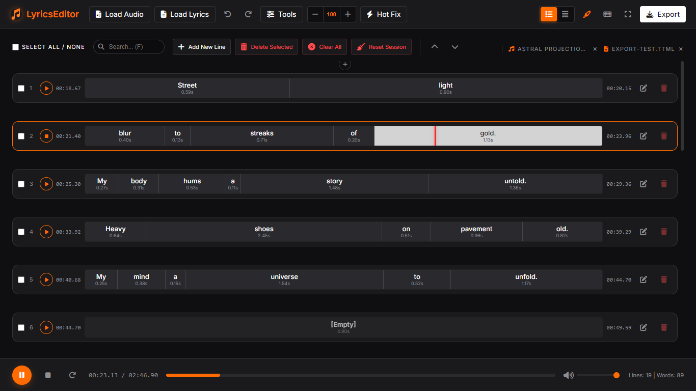

<div align="center">
  
# LyricsEditor - Premium Lyrics & Subtitle Tool


A professional-grade, browser-based word-level lyrics and subtitle editor. Designed for precision, efficiency, and broad format compatibility.

</div>



## ✨ Features

- **Word-Level Precision**: Adjust timings for individual words using an intuitive drag-and-drop timeline.
- **Per-Word Confidence Scoring & Review**:
    - Visual confidence badges for low-confidence alignment words (<75% amber dash, <50% red tint).
    - Header indicator showing total flagged words with one-click navigation and keyboard shortcuts (**Alt+N** / **Alt+P**) to review low-confidence words rapidly.
- **Universal Ghost Word-Block Gap Filling**:
    - Automatically bridges gaps between timestamps across all word-level formats (TTML, `.lyricsfile`, JSON, SRV2/3) with ghost word-blocks (`text: ""`).
    - Keeps word-blocks in each line connected edge-to-edge for continuous dragging, resizing, boundary snapping, and playback transitions.
    - Automatically filters empty ghost blocks on export for clean, spec-compliant output.
- **Enhanced `.lyricsfile` & YAML Support**:
    - Native support for `.lyricsfile`, `.lyricsfile.yaml`, `.yaml`, and `.yml`.
    - Preserves per-word `confidence` / `score`, vocal agents, background vocals, and explicit `start_ms` / `end_ms`.
    - Tolerant parsing for omitted `end_ms` (interpolated automatically) and empty arrays (`words: []`, `words: null`, `words: ~`).
- **Multi-Format Support**: Import and export a wide variety of subtitle, lyrics, and karaoke formats.
- **Advanced Timeline**:
    - Interactive waveform-style word blocks.
    - **Real-Time Waveform Background**: Visualizes audio peaks directly behind word blocks for ultra-precise timing.
    - Drag edges to resize or drag the center to move words.
    - Automatic gap filling and overlapping prevention.
- **Smart Tools**:
    - **Global Tools**: Shift Time, Find & Replace, Sort by Time, Remove Empty Lines, Fill Gaps with Empty Lines, Fill Gap to End of Audio, Fix Overlaps (Shrink), Fix Jumps (Push Sequential), Merge/Split Selected Lines, Smart Merge (via Ref File), Sync Line to Words, Clear All.
    - **Word Tools**: Auto-Generate Word Timings, Fill Gaps, Convert Empty Lines to Ghost Words, Convert Ghost Words to Empty Lines, Remove Word Overlaps, Remove Empty Words, Compact Whitespace, Clear Word Timings, Merge Words in Lines, Join Words (No Spaces), Distribute Words Evenly.
    - **Text Formatting**: Change Case (Title, Sentence, Upper, Lower), Remove Punctuation.
    - **Hot Fix**: One-click cleanup (compact whitespace, remove empty words, fill gaps).
- **Visual Feedback**:
    - **Word-Block Highlighting**: Words illuminate in real-time as the playback cursor passes over them, ensuring perfect synchronization.
    - **Toggle Control**: Easily enable or disable the highlighting feature using the toggle button in the toolbar.
- **Playback & Editing**:
    - High-precision audio playback with granular seeking.
    - Advanced looping modes: **Individual Words** (**L**), **Line** (**R**), and **Entire Song** (**O**).
    - Progress bar seeking and volume control (with shortcut support).
- **Professional UI**:
    - Dark mode by default with a premium aesthetic.
    - Responsive layout (works on tablets and desktops).
    - Compact and Default view modes.
    - Fullscreen support.
- **Workspace Management**:
    - **Drag & Drop**: Seamlessly load audio or lyrics files by dragging them anywhere into the editor.
    - **Add New Line**: Quick insertion button directly in the timeline header.
    - **Delete Selected**: Mass-deletion of checked lines for faster cleanup.
    - **Clear All**: One-click cleanup to reset the entire timeline.
    - **Asset Eject/Reload**: Easily remove or re-load audio and lyrics files.
    - **Smart Tooltips**: Full filename display on hover for easy identification.
    - **Improved Line Editing**: Automatic whitespace and newline normalization when editing text to ensure a clean, one-line structure.
- **Session Persistence**:
    - **Auto-Save**: Progress is automatically saved to local storage.
    - **True Persistence**: Uses **IndexedDB** to store audio and lyrics references, allowing for instant project restoration even after a page refresh (F5) without re-browsing files.
    - **Session Reset**: Clear your workspace and cache with a single "Reset Session" button.
- **Export Configuration**:
    - **Toggle Empty Lines**: Optional automatic insertion of empty "clear screen" lines in LRC and TTML exports to match the editor's visual state.
- **Undo/Redo**: Full history support for all editing actions, including file loading and removal (up to 50 steps).

| | | |
|:-:|:-:|:-:|
|  |  |  |
|  |  |  |

https://github.com/user-attachments/assets/d695af6c-2de2-4083-954b-ee181cbc72d0

## 📥 Supported Formats

### Import
- LRC (Standard & Enhanced with Background Vocals & Song Parts)
- SRT (SubRip)
- VTT (WebVTT)
- TTML (Timed Text Markup Language / Apple iTunes / Apple Music)
- LRCLIB & LyricsFile (`.lyricsfile`, `.lyricsfile.yaml`, `.yaml`, `.yml`)
- Bidirectional JSON (.json with Confidence, Agents, & Song Parts)
- YouTube XML (SRV1, SRV2, SRV3)
- YouTube JSON3
- Audacity Labels (.txt)
- Plain Text (.txt with automatic Song Part recognition)

### Export
- **Subtitles**: LRC, SRT, VTT, TTML, Apple TTML (iTunes), Audacity Labels
- **Karaoke (Word-Level)**: Enhanced LRC, VTT (Words), TTML (Words), Apple TTML (Words), LRCLIB / LyricsFile (`.lyricsfile.yaml`), YouTube SRV3 (Words), Audacity Labels (Words)
- **Other**: YouTube SRV1/SRV2/SRV3, JSON (Bidirectional with Confidence), YouTube JSON3, Audacity Labels, LRCLIB (`.lyricsfile`), YAML (`.yaml`), Plain Text (with Song Parts), Plain Text (without Song Parts)

## 🎵 Audio Precision & Sync

For professional, high-precision work, please consider the following:

- **Format Choice**: Use **WAV** or **FLAC** whenever possible for sample-accurate synchronization.
- **MP3 Limitations**: Standard MP3s may have encoder padding (silence) at the start, causing offsets.
- **Global & Partial Shift**: Use the **`[`** and **`]`** keys (or the UI buttons) to shift timings. If lines are selected, only those will be shifted.
- **Flexible Step**: Adjust the millisecond value in the shift input to control how much time is shifted per click.

## 🧠 Smart Merge & Smart Import

These advanced tools are designed to fix one of the most common issues in lyric editing: **bad line splitting from AI models** (like Whisper or Gemini).

- **The Problem**: AI models often output word-level timestamps with arbitrary line breaks that don't match the song's phrasing or poetic structure.
- **Smart Merge (External Files)**: 
    1. Load your word-timed file (**Primary**).
    2. Click **Smart Merge** in the toolbar and select a "clean" text/lyrics file (**Reference**) that has the correct line phrasing.
    3. The editor will automatically redistribute all word timestamps into the line structure of your reference file, preserving every millisecond of timing while fixing the visual layout instantly.
- **Smart Import (Internal Tracks)**: 
    - If your file contains multiple segments (e.g., an Audacity Label file with separate word and phrase tracks), the **Multiple Segments** modal will appear.
    - Choose **Smart Import** to manually select which track is the **Primary** source and which is the **Reference** source.
    - The editor will execute the merge logic using the internal data of the single file, including built-in line-count validation and text similarity checks.

## ⌨️ Keyboard Shortcuts

### Playback & Volume
| Shortcut | Action |
| :--- | :--- |
| **Space** | Play / Pause Audio |
| **X** | Stop Audio (Reset to start) |
| **L** | Toggle Word Repeat |
| **R** | Toggle Line Repeat (Loop current line) |
| **O** | Toggle Song Repeat |
| **M** | Mute / Unmute Audio |
| **Ctrl + Up / Down** | Increase / Decrease Volume |
| **Left / Right** | Seek Audio (-2s / +2s) |

### Editing & Selection
| Shortcut | Action |
| :--- | :--- |
| **N** | Insert New Blank Line |
| **Delete** | Delete Selected Lines |
| **Up / Down** | Select Previous / Next Line |
| **Home / End** | Jump to First / Last Line |
| **PgUp / PgDn** | Jump 5 Lines Backward / Forward |
| **Ctrl + Z / Y** | Undo / Redo Changes |
| **[ / ]** | Shift Time Backward / Forward (100ms) |
| **Ctrl + [ / ]** | Shift Time (Large Step: 500ms) |

### Tools & UI
| Shortcut | Action |
| :--- | :--- |
| **1 / 2** | Load Audio / Load Lyrics |
| **Alt + N** | **Next Flagged Word** (Jump to next low-confidence word) |
| **Alt + P** | **Prev Flagged Word** (Jump to previous low-confidence word) |
| **E** | **Quick Export** (Prioritizes Word-Level/Karaoke formats) |
| **S** | Focus Search Box |
| **H** | Open Find & Replace |
| **T** | Open Global Time Shift modal |
| **F** | **Hot Fix** (One-click cleanup: compact, remove empty, fill gaps) |
| **G** | **Jump to Line Number** |
| **W** | **Jump to Word Number** |
| **D / C** | Default View / Compact View Mode |
| **P** | Toggle Fullscreen |
| **K** | Open Keyboard Shortcuts help |
| **Esc** | Close Modals / Clear Search focus |

## 🌟 What's New

### v0.1.2

- **Multi-Channel Edit Line Text Modal**:
  - Redesigned the Edit Lyric Line popup modal with dedicated input channels: **Start Background Vocal (Intro)**, **Lead Vocal (Main Lyrics)**, and **End Background Vocal (Outro / Ad-lib)**.
  - Channel-isolated timing alignment engine (`alignChannel`) ensures background vocals and main lyrics do not collide or corrupt word timestamps during editing, blank insertions, or word restructuring.
  - Quick-action buttons to add or remove Start/End background vocal channels with a single click.
  - Full multi-input undo/redo (`Ctrl+Z` / `Ctrl+Y`), real-time highlight synchronization, drag-and-drop text manipulation, and granular word tools (Insert/Remove Blank `\`, Join Words).
- **Automatic Parentheses `(...)` Formatting for Background Vocals**:
  - Background vocal textareas automatically display and wrap words in `( ... )`.
  - Automatically encloses missing parentheses on typing, blur, and applying changes without manual formatting.
- **Song Part Auto-Detection & Section Structure Support**:
  - Auto-detects song part tags (e.g. `[Verse]`, `[Chorus]`, `[Bridge]`, `[Outro]`, `Verse:`, `Intro -`) from imported Plain Text (`.txt`) and LRC files.
  - Preserves `songPart` metadata seamlessly across Smart Merge, Track Line Attributes, and exports.
- **Dual Plain Text Export Options**:
  - **Plain Text (with Song Parts)**: Exports cleanly formatted lyrics under bracketed section headers with double-spaced stanza breaks.
  - **Plain Text (without Song Parts)**: Exports pure, clean lyrics text.
- **LyricsFile YAML Export & Restored Format Suite**:
  - Added **LyricsFile YAML (`.lyricsfile.yaml`)** with per-word confidence scoring, line-level `songPart`, and background vocal roles.
  - Restored explicit **LRCLIB (`.lyricsfile`)**, **YAML (`.yaml`)**, and **YouTube JSON3** export options.
- **Unified Background Vocal `<span ttm:role="x-bg">` Grouping (Apple TTML & TTML)**:
  - Solved fragmented background vocal spans when vocal timestamps overlap with lead lyrics.
  - Groups continuous background vocal phrases into a single, cohesive `<span ttm:role="x-bg">` block adhering to the **Apple Music TTML / W3C TTML Lyric Standard**.

### v0.1.1

- **Per-Word Confidence Scoring & Rapid Review Navigation**:
  - Highlights alignment confidence directly on word blocks (<75% amber dash, <50% red tint).
  - Added dedicated header badge and navigation controls with **Alt+N** (Next) and **Alt+P** (Prev) shortcuts for rapid review of low-confidence words during or after audio playback.
- **Universal Ghost Word-Block Gap Filling on Import**:
  - Automatically bridges gaps between timestamps across all word-level formats (`TTML`, `.lyricsfile.yaml`, `JSON`, `SRV2/3`) with ghost word-blocks (`text: ""`).
  - Keeps word blocks in each line connected edge-to-edge for smooth timeline dragging, resizing, boundary snapping, and playback transitions.
  - Automatically filters ghost blocks on export so output files remain standard-compliant with only sung lyric spans.
- **Enhanced `.lyricsfile.yaml` & YAML Engine**:
  - Native line-by-line / indentation-aware parser for `.lyricsfile`, `.lyricsfile.yaml`, `.yaml`, and `.yml`.
  - Preserves per-word `confidence` / `score`, vocal agents, background vocal flags, and explicit `start_ms` / `end_ms`.
  - Tolerates omitted `end_ms` with automatic boundary interpolation, and handles empty word arrays (`words: []`, `words: null`, `words: ~`).
- **Enhanced Background Vocal Editing & Smart Tokenization**:
  - Resolved word-block disconnection issues when editing background vocal lines with spaces around parentheses (e.g. `( test )`, `( word1 word2 )`).
  - Parentheses are extracted cleanly as channel delimiters without generating phantom word-blocks or corrupting word timings.
- **Active Word Detection & Playback Navigation Fix**:
  - Fixed timestamp scale calculation and active word boundary tracking so `Alt+N` and `Alt+P` jump accurately forward and backward even during active audio playback.
- **Empty Line & Ghost Word-Block Bi-Directional Conversion Tools**:
  - **Convert Empty Lines to Ghost Words**: Converts empty lines into trailing ghost word-blocks attached to the preceding lyric line (keeping top empty lines intact).
  - **Convert Ghost Words to Empty Lines**: Intelligently extracts ghost word-blocks into empty lines above, below, or splitting the line in the middle.

### v0.1.0

- **UI/UX Improvements & Refinements**:
  - Comprehensive UI/UX testing and evaluation with the **KIMI K3** model.
  - Enhanced layout ergonomics and visual polish across the timeline, modals, and toolbar controls.
  - Optimized interactive feedback, transitions, and responsive adaptations for dense editing sessions.

### v0.0.9

- **Parentheses Background Vocal Sync Fix**: Resolved an issue where adding or removing parentheses `( )` in the Edit Text modal did not update the background vocal role (`x-bg`) on the timeline track when words matched identical or LCS tokens.
- **Isolated Row Drag Boundaries**: Drag boundaries and sibling interactions are now isolated between main vocals and background vocals. Adjusting background vocal blocks no longer bumps into or is constrained by main vocal blocks, allowing them to freely overlap.
- **Improved Multi-Row Overlap Editing**: Any track containing both main and background vocal words now automatically displays in double rows when hovered or dragged (regardless of whether they already overlap), giving users the immediate visual space to align overlapping parts.

### v0.0.8

- **Integrated Metadata Editor**: Added a tag editor popup under the Tools dropdown. Allows editing global parameters (Title, Artist, Album, Language, Creator, Lyricist, Copyright, iTunes Timing Mode, Leading Silence, Agent list, and Songwriters).
- **ID3 Tag & Lyrics Metadata Extraction**: Supports extracting ID3v2 tags directly from loaded audio files (or using filename heuristics) and extracting lyrics headers from loaded LRC/TTML files. Includes a confirmation check to prevent accidental overwrites.
- **Apple Music / iTunes TTML Support**: Adds export options for `Apple TTML (iTunes)` and `Apple TTML (Words)` Karaoke, including songwriters metadata, agents definitions, and segment groupings.
- **Interactive Multi-Row Overlap Layout**: Resolves timing overlap editing blocks. Sequential words layout on one row, but overlapping main and background vocal blocks dynamically split into double rows on hover or drag to make editing boundary timestamps simple.
- **Parentheses-Based Background Vocal Input**: Typing words inside parentheses `( )` in the Edit Text modal automatically flags them as background vocals (`ttm:role="x-bg"`).
- **Line Attributes dialog**: Added a tag icon button on timeline tracks to customize song parts (`itunes:song-part`) and vocal agents (`ttm:agent`). Includes option to automatically propagate parts to subsequent lines.
- **Symmetrical Track Indicators**: Redesigned left-hand `track-info` and right-hand `track-end-time` layouts into stacked double rows. Displays vocal agent and song part badges on the left, balanced by a purple `BG` indicator badge on the right, keeping layouts symmetrical and highly readable on narrow or portrait viewports.
- **Bidirectional JSON Support**: Fully exports and imports comprehensive song metadata (title, artist, album, language, agents list, songwriters, and duration) alongside explicit cue/word properties (vocal agents, song parts, background vocal roles, and exact timing ranges).

### v0.0.7

- **In-Browser AIFF Audio Support**: Adds full client-side decoding and conversion of AIFF (`.aif`, `.aiff`) audio files.
  - Custom binary parser manually extracts AIFF `FORM`, `COMM`, and `SSND` chunks.
  - Supports converting 8-bit, 16-bit, 24-bit, and 32-bit big-endian PCM samples into standard 16-bit little-endian WAV format on the fly.
  - Decodes 80-bit IEEE 754 extended precision float structures for accurate sample rate conversion.
  - Enables natively unsupported AIFF files to play seamlessly and render precise waveforms.
- **Improved Media Accessibility**: Integrated `.aif` and `.aiff` file formats into the standard audio file inputs and drag-and-drop workspace detectors.
- **Responsive Layout Optimization**: Configured `#btn-hotfix` to hide its text label and transition to icon-only mode on medium screens (under `1280px`), maximizing toolbar layout efficiency.
- **Clean Source Formatting**: Replaced corrupted separator characters (`──`) in code comments with clean, standardized comment formatting for improved code readability.

### v0.0.6

- **Full Undo/Redo Session Persistence**: The entire multi-step undo/redo history stack (`history`) and current pointer index (`histIdx`) are now securely serialized and persisted in `localStorage` alongside your session. Refreshing (F5) or reloading the page no longer wipes out your undo/redo history, letting you step back and forth through your changes seamlessly!
- **Punctuation-Only Word-Block Merger**: Solves the issue of floating punctuation word-blocks (like `.` or `,`) by automatically merging them into their preceding word blocks (appending the text and extending the duration). This cleans up the alignment pool and prevents timing gaps or syllable-shift conflicts.
- **Smart Tag-Aware Alignment**: Automatically isolates bracketed or parenthesized tags (like `[Music]`, `(Instrumental)`) in the primary timeline during alignment. Skipped tags keep their exact original timings and are neatly converted into clean timeline empty lines, ensuring they never shift or pull subsequent lyric words out of sync.
- **Powerhouse Combined Smart Merge & Replace Tool**: Added the "Smart Merge + Replace Text" tool to the global list, combining structural alignment of AI line breaks with advanced reference-based text replacement.
- **Overlap-Free Timeline Structure**: Updated both standard and combined reference-based merge engines to ignore empty reference lines, completely preventing redundant timing overlaps and keeping your editor layout perfectly compact.
- **Direct Toolbar Shortcuts**: Added a new direct-access shortcut button for **Smart Replace Text** in the header toolbar. Featuring a responsive `desktop-only` design, it automatically adjusts for tablet and mobile views.

### v0.0.5

- **Enhanced Navigation Suite**: Added high-precision "Jump to Line" (**G**) and "Jump to Word" (**W**) modals with vertical adjustment controls for lightning-fast timeline navigation.
- **Advanced Loop Controls**: Expanded looping capabilities with dedicated modes for **Individual Words** (**L**) and **Entire Song** (**O**) (previously only available for **Line** (**R**)). Features a "Loop Lock" mechanism to prevent synchronization drift during word-level editing.
- **Shortcuts Refinement**: Reassigned core shortcuts for better mnemonics (e.g., **P** for Fullscreen, **O** for s**OOOOO**ng loop) and added keyboard shortcut tips to the initial placeholder screen.
- **UI Polishing**: Redesigned numeric input controls in modals to remove browser default spin buttons, replacing them with a custom premium vertical UI.
- **Comprehensive Gap Filling**: Expanded the gap-filling suite with "Fill Gap to Start of Audio" and "Fill All Gaps" (Start, Middle, and End). These tools ensure your lyrics cover the entire audio timeline perfectly, preventing unintended "blank screens" during playback.
- **Audacity Labels Power-Suite**: Full support for importing and exporting Audacity Label formats. Includes a specialized **Word-Level Export** mode that generates individual labels for every word in the timeline.
- **Advanced Multi-Segment Import**: Automatically detects multiple tracks or segments within VTT, SRT, and Audacity Labels files. New modal allows selecting specific tracks, joining all, or using Smart Import.
- **Manual Smart Import (Integrated Smart Merge)**: Manually pick your "Primary" timing track and "Reference" phrasing track from a single multi-segment file. This feature leverages the **Smart Merge** logic to automatically fix AI-generated line breaks by realigning word timings to your preferred structure, featuring line-count validation and similarity checks.
- **Real-Time Audio Waveform Background**: Added professional-grade audio waveform visualization behind every line in the timeline. Features symmetric peaks, auto-normalization, and layout-safe rendering for high-precision synchronization.
- **Intelligent Blank-Word Management**: 
    - **Auto-Conversion**: Empty lines automatically become "Ghost" blocks when merged into other lines to preserve silence.
    - **Smart Normalization**: Lines containing only blank words automatically revert to clean `[Empty]` placeholders after structural operations.
- **Advanced Timeline Integrity Tools**:
    - **Upgraded Hot Fix**: A one-click solution that now resolves word overlaps, fills timing gaps, and cleans up whitespace in a single pass.
    - **Fix Jumps (Push Sequential)**: A new cascading shift tool that resolves line collisions by pushing subsequent lines forward, preserving original durations and phrasing.
    - **Strict LRC Parsing**: The engine now strictly enforces line boundaries during import, automatically clamping word timestamps to prevent "backward jumps."
- **Edit Modal Enhancements**:
    - **Smarter Deletion**: Deleting words or placeholders (`\`) in the text modal now automatically merges their duration into the preceding word to fill the gap.
    - **Partial Joining**: The "Join Words" tool now supports selected text ranges for granular syllable merging.
    - **Refined Blank Removal**: The "Remove Blanks" tool now rejoins syllables perfectly without leaving orphaned spaces.
    - **Improved Tokenization**: Special symbols (`\`, `"`) are now treated as independent tokens even when attached to words, preventing accidental word merging.
- **UI/UX Refinements**: 
    - **Scroll Preservation**: Maintains scroll position during all structural operations (merge, split, edit).
    - **Muted Ghost Visuals**: Blank blocks now feature a muted background with a backdrop blur to make the background waveform less distracting.
- **Performance Optimization**: Waveform caching and 60fps rendering ensure a lag-free experience even on low-end devices.
- **Toolbar Refinement**: Synchronized action icons across the UI and added direct "Split" and "Smart Merge" buttons to the header toolbar. Improved mobile responsiveness for tool-heavy layouts.

### v0.0.4

- **Flexible Shift Control**: Added a new UI widget to shift time by custom millisecond amounts. Now supports shifting only selected lines or the whole timeline.
- **Improved Search UI**: Moved the search box to the timeline header for better focus. Added a minimal "x" button to clear filters instantly.
- **Safe Drag & Drop**: Refined the loading logic to prevent accidental file overwrites and limit drops to 1 audio + 1 lyrics file at a time.
- **Selection Feedback**: Added a live count of selected lines to the "Select All" label and implemented the indeterminate checkbox state.
- **Tablet-First Optimization**: Increased the mobile breakpoint to `1024px` to provide full "Icon-Only" support for iPad Air, iPad Pro (portrait), Surface Pro, and other mid-sized tablets.
- **Branded Logo Integration**: Replaced generic icons with the official `favicon.svg`, featuring a premium orange glow effect for better brand identity.
- **Global Icon-Only Mode**: Extended the smart icon transformation to the primary **Export** button and **App Logo**, ensuring zero layout overflow on narrow screens.
- **Zero-Overflow Header**: Grouped filenames and navigation controls ergonomically. Implemented thumb-friendly top-row navigation for arrows and dynamic filename widths (200px on desktop, 100px on mobile).
- **Track-Level Play/Stop Toggle**: Play buttons in the timeline rows now act as dynamic toggles (switching to a Stop icon when active) for faster playback control.
- **Auto-Scroll Navigation**: The Up/Down navigation buttons now automatically scroll and center the active lyrics line in view, even when paused.
- **UI structural Integrity**: Wrapped all button labels in spans to ensure robust responsive behavior and clean layout resets.
- **UI Polish**: Added "Pro Tips" for audio precision and improved the placeholder instructions for new users.

### v0.0.3

**Major Features & Persistence**
- **True Session Persistence**: Integrated IndexedDB to securely store audio and lyrics references. Your progress is now automatically saved and persists even after refreshing the page or closing the browser.
- **Automatic Audio Restoration**: Audio sources now reconnect automatically in the background after a page refresh, ensuring sound is ready without manual re-loading.
- **Asynchronous Initialization**: Improved startup performance by loading large assets in the background, keeping the UI responsive and instant.
- **Drag & Drop Support**: You can now load audio or lyrics files by simply dragging them anywhere into the editor. Includes safety alerts to prevent accidental file replacement.

**Workspace & Productivity**
- **Mass Deletion**: Added a new "Delete Selected" tool and keyboard shortcut (**Delete**) to remove multiple lines at once.
- **Quick Line Insertion**: Added a dedicated "Add New Line" button in the timeline header and shortcut (**N**) for faster editing.
- **Improved Line Editing**: The "Edit Line Text" modal now automatically normalizes whitespace and newlines, providing a clean, single-line editing experience.
- **Asset Management**: Refined the file eject/reload system with intuitive sync icons and full-filename tooltips on hover.
- **Improved Undo/Redo**: The history system now tracks all actions, including asset management and line deletions.

**Export Improvements**
- **Smart Quick Export**: The **`E`** shortcut now automatically prioritizes **Word-Level (Karaoke)** formats. 
- **TXT-to-TTML Mapping**: Plain text (.txt) files are now automatically quick-exported as **TTML Karaoke** files to preserve your timing work.
- **Export Configuration**: Added a toggle in the export menu to control the automatic insertion of empty "clear screen" lines for LRC and TTML formats.

**Technical Fixes**
- Fixed the issue where audio would play without sound after a page refresh.
- Improved text parsing to handle multi-line SRT/VTT cues more efficiently.
- Fixed history reset bugs when loading new assets.

---

## 🔌 Offline Mode Setup

To use LyricsEditor without an internet connection, you need to localize external dependencies:

### 1. Download Font Awesome 6.7.2
1. Download the **Font Awesome Free for Web** version `6.7.2` [here](https://fontawesome.com/download).
2. Extract the archive and copy the `css` and `webfonts` folders into your project directory (e.g., into a folder named `lib/font-awesome`).
3. Update the link in `index.html`:
   ```diff
   - <link rel="stylesheet" href="https://cdnjs.cloudflare.com/ajax/libs/font-awesome/6.7.2/css/all.min.css">
   + <link rel="stylesheet" href="lib/font-awesome/css/all.min.css">
   ```

### 2. Localize Fonts (Optional)
The app uses the "Inter" font from Google Fonts. For full offline support:
1. Download "Inter" from [Google Fonts](https://fonts.google.com/specimen/Inter).
2. Install it on your system or host it locally using `@font-face` in `styles.css`.
3. Alternatively, remove the Google Fonts link in `index.html` to use system default sans-serif fonts.

### 3. Run Locally
Once the files are downloaded, you can simply open `index.html` in any modern web browser. No local server is required.

---

## 🛠️ Technical Details

- **Framework**: No framework (Vanilla JS).
- **Precision**: Uses `requestAnimationFrame` for high-precision synchronization between audio and UI.
- **Persistence**: Implements a dual-storage system:
    - **LocalStorage**: Stores text metadata, editing lines, and UI preferences.
    - **IndexedDB**: Persists large binary assets (Audio & Lyrics files) to allow instant re-loading without server-side storage.
- **Privacy & Security**: 100% Client-Side. No data is ever uploaded to a server. All processing and storage happen locally within your browser's private sandbox.

## 📄 License

MIT License
